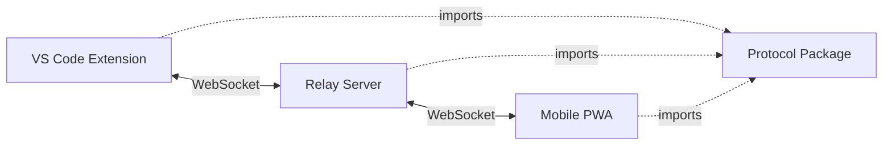

# Design Document: CodeLink Project Initialization

## Overview

This design establishes the foundational structure for CodeLink, a human-in-the-loop AI tele-operation system for software development. The initialization creates a TypeScript monorepo with four packages: a VS Code extension, a WebSocket relay server, a React-based mobile PWA, and a shared protocol package for type-safe communication.

The design prioritizes production-grade configuration, clear separation of concerns, and minimal working functionality. Each component will have "hello world" level implementation to verify the setup works correctly before feature development begins.

**Key Architectural Decisions:**
- **Monorepo with npm workspaces**: Simplifies dependency management and enables workspace package references
- **TypeScript everywhere**: Ensures type safety across all components and shared protocol
- **Vite for mobile client**: Fast development experience and optimized production builds
- **WebSocket for relay**: Stateless pass-through architecture with minimal server logic
- **Shared protocol package**: Single source of truth for message types prevents drift

## Architecture

### System Components

```
codelink/
├── packages/
│   ├── protocol/          # Shared TypeScript types and contracts
│   ├── vscode-extension/  # Local VS Code extension
│   ├── relay-server/      # Cloud WebSocket relay
│   └── mobile-client/     # Mobile PWA (React + Vite)
├── package.json           # Root workspace configuration
├── tsconfig.base.json     # Shared TypeScript config
├── .eslintrc.json         # Shared ESLint config
├── .prettierrc.json       # Shared Prettier config
└── README.md              # Architecture and setup docs
```

### Communication Flow



The relay server acts as a stateless pass-through, forwarding messages between the extension and mobile client without processing or storing them.

## Components and Interfaces

### 1. Root Workspace Configuration

**File: `package.json`**

```json
{
  "name": "codelink",
  "version": "0.1.0",
  "private": true,
  "workspaces": [
    "packages/*"
  ],
  "scripts": {
    "build": "npm run build --workspaces --if-present",
    "dev": "npm run dev --workspaces --if-present",
    "lint": "eslint . --ext .ts,.tsx",
    "format": "prettier --write \"**/*.{ts,tsx,json,md}\"",
    "format:check": "prettier --check \"**/*.{ts,tsx,json,md}\""
  },
  "devDependencies": {
    "@typescript-eslint/eslint-plugin": "^6.0.0",
    "@typescript-eslint/parser": "^6.0.0",
    "eslint": "^8.0.0",
    "prettier": "^3.0.0",
    "typescript": "^5.0.0"
  }
}
```

**Rationale:** npm workspaces provide native monorepo support without additional tooling. Scripts use `--workspaces` flag to run commands across all packages.

### 2. TypeScript Base Configuration

**File: `tsconfig.base.json`**

```json
{
  "compilerOptions": {
    "target": "ES2020",
    "module": "commonjs",
    "lib": ["ES2020"],
    "strict": true,
    "esModuleInterop": true,
    "skipLibCheck": true,
    "forceConsistentCasingInFileNames": true,
    "moduleResolution": "node",
    "resolveJsonModule": true,
    "declaration": true,
    "declarationMap": true,
    "sourceMap": true,
    "composite": true,
    "incremental": true
  }
}
```

**Rationale:** Strict mode catches type errors early. Composite and incremental enable fast rebuilds. Declaration files allow workspace packages to reference each other with full type information.

### 3. Code Quality Configuration

**File: `.eslintrc.json`**

```json
{
  "parser": "@typescript-eslint/parser",
  "extends": [
    "eslint:recommended",
    "plugin:@typescript-eslint/recommended"
  ],
  "parserOptions": {
    "ecmaVersion": 2020,
    "sourceType": "module"
  },
  "rules": {
    "@typescript-eslint/no-unused-vars": ["error", { "argsIgnorePattern": "^_" }],
    "@typescript-eslint/explicit-function-return-type": "off"
  }
}
```

**File: `.prettierrc.json`**

```json
{
  "semi": true,
  "trailingComma": "es5",
  "singleQuote": true,
  "printWidth": 100,
  "tabWidth": 2
}
```

**Rationale:** Minimal configuration using recommended defaults. Only override rules that cause friction in TypeScript development.

### 4. Protocol Package

**File: `packages/protocol/package.json`**

```json
{
  "name": "@codelink/protocol",
  "version": "0.1.0",
  "main": "./dist/index.js",
  "types": "./dist/index.d.ts",
  "scripts": {
    "build": "tsc",
    "dev": "tsc --watch"
  },
  "devDependencies": {
    "typescript": "^5.0.0"
  }
}
```

**File: `packages/protocol/tsconfig.json`**

```json
{
  "extends": "../../tsconfig.base.json",
  "compilerOptions": {
    "outDir": "./dist",
    "rootDir": "./src"
  },
  "include": ["src/**/*"]
}
```

**File: `packages/protocol/src/index.ts`**

```typescript
// Base message structure
export interface Message {
  id: string;
  timestamp: number;
  type: string;
}

// Example: Ping message from extension to relay
export interface PingMessage extends Message {
  type: 'ping';
  source: 'extension' | 'mobile';
}

// Example: Pong response from relay
export interface PongMessage extends Message {
  type: 'pong';
  originalId: string;
}

// Union type for all messages
export type ProtocolMessage = PingMessage | PongMessage;
```

**Rationale:** Simple message hierarchy with discriminated unions enables type-safe message handling. Starting with ping/pong provides a minimal working example.

### 5. VS Code Extension Package

**File: `packages/vscode-extension/package.json`**

```json
{
  "name": "codelink-extension",
  "displayName": "CodeLink",
  "version": "0.1.0",
  "publisher": "codelink",
  "engines": {
    "vscode": "^1.80.0"
  },
  "categories": ["Other"],
  "activationEvents": ["onCommand:codelink.hello"],
  "main": "./dist/extension.js",
  "contributes": {
    "commands": [
      {
        "command": "codelink.hello",
        "title": "CodeLink: Hello World"
      }
    ]
  },
  "scripts": {
    "build": "tsc",
    "dev": "tsc --watch"
  },
  "dependencies": {
    "@codelink/protocol": "*"
  },
  "devDependencies": {
    "@types/vscode": "^1.80.0",
    "typescript": "^5.0.0"
  }
}
```

**File: `packages/vscode-extension/tsconfig.json`**

```json
{
  "extends": "../../tsconfig.base.json",
  "compilerOptions": {
    "outDir": "./dist",
    "rootDir": "./src",
    "module": "commonjs",
    "lib": ["ES2020"]
  },
  "include": ["src/**/*"]
}
```

**File: `packages/vscode-extension/src/extension.ts`**

```typescript
import * as vscode from 'vscode';
import { PingMessage } from '@codelink/protocol';

export function activate(context: vscode.ExtensionContext) {
  const disposable = vscode.commands.registerCommand('codelink.hello', () => {
    // Example: Create a typed message
    const message: PingMessage = {
      id: crypto.randomUUID(),
      timestamp: Date.now(),
      type: 'ping',
      source: 'extension',
    };

    vscode.window.showInformationMessage(
      `CodeLink Extension Active! Message ID: ${message.id}`
    );
  });

  context.subscriptions.push(disposable);
}

export function deactivate() {}
```

**Rationale:** Minimal extension that demonstrates activation, command registration, and protocol usage. Uses VS Code's standard extension structure.

### 6. Relay Server Package

**File: `packages/relay-server/package.json`**

```json
{
  "name": "@codelink/relay-server",
  "version": "0.1.0",
  "main": "./dist/index.js",
  "scripts": {
    "build": "tsc",
    "dev": "tsc --watch",
    "start": "node dist/index.js"
  },
  "dependencies": {
    "@codelink/protocol": "*",
    "ws": "^8.0.0"
  },
  "devDependencies": {
    "@types/node": "^20.0.0",
    "@types/ws": "^8.0.0",
    "typescript": "^5.0.0"
  }
}
```

**File: `packages/relay-server/tsconfig.json`**

```json
{
  "extends": "../../tsconfig.base.json",
  "compilerOptions": {
    "outDir": "./dist",
    "rootDir": "./src",
    "module": "commonjs",
    "lib": ["ES2020"]
  },
  "include": ["src/**/*"]
}
```

**File: `packages/relay-server/src/index.ts`**

```typescript
import { WebSocketServer, WebSocket } from 'ws';
import { ProtocolMessage, PongMessage } from '@codelink/protocol';

const PORT = process.env.PORT ? parseInt(process.env.PORT) : 8080;

const wss = new WebSocketServer({ port: PORT });

console.log(`CodeLink Relay Server listening on port ${PORT}`);

wss.on('connection', (ws: WebSocket) => {
  console.log('Client connected');

  ws.on('message', (data: Buffer) => {
    try {
      const message: ProtocolMessage = JSON.parse(data.toString());
      console.log('Received message:', message.type);

      // Example: Respond to ping with pong
      if (message.type === 'ping') {
        const pong: PongMessage = {
          id: crypto.randomUUID(),
          timestamp: Date.now(),
          type: 'pong',
          originalId: message.id,
        };
        ws.send(JSON.stringify(pong));
      }
    } catch (error) {
      console.error('Failed to parse message:', error);
    }
  });

  ws.on('close', () => {
    console.log('Client disconnected');
  });
});
```

**Rationale:** Minimal WebSocket server using the `ws` library. Demonstrates message parsing with protocol types and basic ping/pong handling.

### 7. Mobile Client Package

**File: `packages/mobile-client/package.json`**

```json
{
  "name": "@codelink/mobile-client",
  "version": "0.1.0",
  "type": "module",
  "scripts": {
    "dev": "vite",
    "build": "tsc && vite build",
    "preview": "vite preview"
  },
  "dependencies": {
    "@codelink/protocol": "*",
    "react": "^18.0.0",
    "react-dom": "^18.0.0"
  },
  "devDependencies": {
    "@types/react": "^18.0.0",
    "@types/react-dom": "^18.0.0",
    "@vitejs/plugin-react": "^4.0.0",
    "typescript": "^5.0.0",
    "vite": "^5.0.0"
  }
}
```

**File: `packages/mobile-client/tsconfig.json`**

```json
{
  "extends": "../../tsconfig.base.json",
  "compilerOptions": {
    "target": "ES2020",
    "lib": ["ES2020", "DOM", "DOM.Iterable"],
    "module": "ESNext",
    "moduleResolution": "bundler",
    "jsx": "react-jsx",
    "outDir": "./dist",
    "rootDir": "./src"
  },
  "include": ["src/**/*"]
}
```

**File: `packages/mobile-client/vite.config.ts`**

```typescript
import { defineConfig } from 'vite';
import react from '@vitejs/plugin-react';

export default defineConfig({
  plugins: [react()],
  server: {
    port: 3000,
  },
});
```

**File: `packages/mobile-client/index.html`**

```html
<!DOCTYPE html>
<html lang="en">
  <head>
    <meta charset="UTF-8" />
    <meta name="viewport" content="width=device-width, initial-scale=1.0" />
    <meta name="theme-color" content="#000000" />
    <link rel="manifest" href="/manifest.json" />
    <title>CodeLink</title>
  </head>
  <body>
    <div id="root"></div>
    <script type="module" src="/src/main.tsx"></script>
  </body>
</html>
```

**File: `packages/mobile-client/public/manifest.json`**

```json
{
  "name": "CodeLink",
  "short_name": "CodeLink",
  "description": "AI tele-operation for software development",
  "start_url": "/",
  "display": "standalone",
  "theme_color": "#000000",
  "background_color": "#ffffff",
  "icons": [
    {
      "src": "/icon-192.png",
      "sizes": "192x192",
      "type": "image/png"
    },
    {
      "src": "/icon-512.png",
      "sizes": "512x512",
      "type": "image/png"
    }
  ]
}
```

**File: `packages/mobile-client/src/main.tsx`**

```typescript
import React from 'react';
import ReactDOM from 'react-dom/client';
import App from './App';

ReactDOM.createRoot(document.getElementById('root')!).render(
  <React.StrictMode>
    <App />
  </React.StrictMode>
);
```

**File: `packages/mobile-client/src/App.tsx`**

```typescript
import React, { useState, useEffect } from 'react';
import { PingMessage, PongMessage } from '@codelink/protocol';

function App() {
  const [status, setStatus] = useState<string>('Disconnected');
  const [lastPong, setLastPong] = useState<string>('');

  useEffect(() => {
    // Example: Connect to relay server (placeholder URL)
    const ws = new WebSocket('ws://localhost:8080');

    ws.onopen = () => {
      setStatus('Connected');
      
      // Send a ping message
      const ping: PingMessage = {
        id: crypto.randomUUID(),
        timestamp: Date.now(),
        type: 'ping',
        source: 'mobile',
      };
      ws.send(JSON.stringify(ping));
    };

    ws.onmessage = (event) => {
      const message: PongMessage = JSON.parse(event.data);
      if (message.type === 'pong') {
        setLastPong(message.id);
      }
    };

    ws.onclose = () => {
      setStatus('Disconnected');
    };

    return () => {
      ws.close();
    };
  }, []);

  return (
    <div style={{ padding: '20px', fontFamily: 'sans-serif' }}>
      <h1>CodeLink Mobile Client</h1>
      <p>Status: {status}</p>
      {lastPong && <p>Last pong received: {lastPong}</p>}
    </div>
  );
}

export default App;
```

**Rationale:** Vite provides fast development and optimized builds. React is industry-standard for PWAs. The minimal app demonstrates WebSocket connection and protocol usage.

## Data Models

### Message Structure

All messages follow a common base structure:

```typescript
interface Message {
  id: string;        // Unique identifier (UUID)
  timestamp: number; // Unix timestamp in milliseconds
  type: string;      // Discriminator for message type
}
```

**Design Decision:** Using a discriminated union with a `type` field enables TypeScript to narrow types automatically in switch statements and conditionals.

### Protocol Extension Pattern

New message types extend the base `Message` interface:

```typescript
interface NewMessageType extends Message {
  type: 'new-message-type';
  // Additional fields specific to this message type
}
```

The `ProtocolMessage` union type must be updated to include new message types:

```typescript
export type ProtocolMessage = PingMessage | PongMessage | NewMessageType;
```

**Design Decision:** This pattern ensures all messages have consistent structure while allowing type-safe handling of specific message types.


## Correctness Properties

*A property is a characteristic or behavior that should hold true across all valid executions of a system—essentially, a formal statement about what the system should do. Properties serve as the bridge between human-readable specifications and machine-verifiable correctness guarantees.*

### Property Reflection

After analyzing all acceptance criteria, I identified several areas where properties can be consolidated:

- **File existence checks** (1.1, 1.2, 1.3, 3.1, 4.1, 4.2, 9.1, etc.) can be combined into a single comprehensive property that verifies all required files exist
- **Package.json field checks** (2.1, 2.2, 2.5, 5.1, 5.2, etc.) can be combined into a property that verifies all package.json files have required fields
- **TypeScript configuration checks** (3.2, 3.4, 3.5) can be combined into properties about configuration consistency
- **Build success checks** (5.4, 7.5, 11.4, 11.5) can be combined into a single property about successful compilation

Many criteria are about runtime behavior (extension activation, server listening, browser rendering) which cannot be tested through static analysis. These will be validated through manual testing or integration tests, not property-based tests.

### Properties

**Property 1: Required project structure exists**

*For any* initialized CodeLink project, all required directories and files SHALL exist at their expected locations, including: packages/ directory, four package subdirectories (protocol, vscode-extension, relay-server, mobile-client), root configuration files (package.json, tsconfig.base.json, .eslintrc.json, .prettierrc.json), and README.md.

**Validates: Requirements 1.1, 1.2, 1.3, 3.1, 4.1, 4.2, 9.1**

**Property 2: All package.json files contain required fields**

*For any* package in the workspace, its package.json SHALL contain all required fields for its package type: name, version, and scripts (build, dev) for all packages; additionally, engines and activationEvents for the VS Code extension; additionally, type: "module" for the mobile client.

**Validates: Requirements 2.1, 2.2, 2.5, 5.1, 5.2, 6.1, 10.2, 10.3, 10.4, 12.2**

**Property 3: All TypeScript configurations extend base configuration**

*For any* package with TypeScript, its tsconfig.json SHALL extend the root tsconfig.base.json using the "extends" field with the correct relative path.

**Validates: Requirements 3.2**

**Property 4: Configuration files contain no placeholder content**

*For any* configuration file in the project (package.json, tsconfig.json, .eslintrc.json, .prettierrc.json), the file SHALL NOT contain placeholder comments or TODO markers such as "TODO", "FIXME", "PLACEHOLDER", or "CHANGEME".

**Validates: Requirements 12.1**

**Property 5: All packages have appropriate entry points**

*For any* package that produces output, its package.json SHALL define an entry point using the "main" field pointing to the compiled output directory.

**Validates: Requirements 12.3**

**Property 6: All packages compile successfully**

*For any* package with a build script, running the build command SHALL complete without TypeScript compilation errors and produce output files in the expected dist/ directory.

**Validates: Requirements 5.4, 7.5, 11.4, 11.5**

**Property 7: Protocol package exports are importable**

*For any* component package (vscode-extension, relay-server, mobile-client), importing types from @codelink/protocol SHALL succeed with full type information after the protocol package is built.

**Validates: Requirements 8.1, 8.2, 8.3, 8.4**

**Property 8: README contains required documentation sections**

*For any* initialized CodeLink project, the README.md SHALL contain sections describing: architecture overview, setup instructions (with "install" or "npm install"), development instructions (with "dev" or "development"), and core principles (mentioning "no cloud IDE", "no repo sync", or "human approval").

**Validates: Requirements 9.3, 9.4, 9.5**

### Example-Based Tests

Some requirements are best validated with specific examples rather than properties:

- **TypeScript strict mode enabled**: Verify tsconfig.base.json has `"strict": true`
- **Workspace configuration**: Verify root package.json has `"workspaces": ["packages/*"]`
- **VS Code extension structure**: Verify extension package.json has required VS Code fields
- **Relay server dependencies**: Verify relay-server package.json includes "ws" dependency
- **Mobile client uses Vite and React**: Verify mobile-client package.json includes "vite", "react", and "react-dom"
- **PWA manifest exists**: Verify mobile-client/public/manifest.json exists
- **Protocol defines message types**: Verify protocol/src/index.ts exports PingMessage and PongMessage types

### Edge Cases

- **Empty packages directory**: The build system should handle the case where packages/ exists but is empty (though this violates requirements)
- **Missing dependencies**: If a package's dependencies aren't installed, builds should fail with clear error messages
- **Port conflicts**: The relay server should handle the case where the configured port is already in use

## Error Handling

### Build Errors

**TypeScript Compilation Failures:**
- Each package's build script will output TypeScript errors to stderr
- Error messages include file paths and line numbers for debugging
- Build process exits with non-zero status code on failure

**Missing Dependencies:**
- npm will report missing dependencies during install
- Workspace dependencies are resolved automatically by npm
- External dependencies must be explicitly declared in package.json

### Runtime Errors

**VS Code Extension:**
- Extension activation failures are logged to VS Code's Output panel
- Command registration errors prevent the command from appearing in the command palette
- Unhandled exceptions in commands show error notifications to the user

**Relay Server:**
- WebSocket server failures (e.g., port in use) are logged to console and exit the process
- Invalid message parsing is caught and logged without crashing the server
- Client disconnections are handled gracefully with cleanup

**Mobile Client:**
- React errors are caught by error boundaries (to be implemented in future)
- WebSocket connection failures show in browser console
- Failed message parsing is logged without crashing the app

## Testing Strategy

### Dual Testing Approach

This project will use both **unit tests** and **property-based tests** to ensure comprehensive coverage:

- **Unit tests**: Verify specific examples, edge cases, and error conditions
- **Property tests**: Verify universal properties across all inputs

### Property-Based Testing

**Library Selection:**
- For TypeScript/JavaScript packages: Use **fast-check** library
- Minimum 100 iterations per property test
- Each test must reference its design document property using a comment tag

**Tag Format:**
```typescript
// Feature: codelink-initialization, Property 1: Required project structure exists
```

**Property Test Implementation:**
- Property 1-5: Static analysis tests that verify file structure and configuration
- Property 6: Integration test that runs build commands and verifies output
- Property 7: Integration test that imports protocol types in each package
- Property 8: Static analysis test that parses README.md content

### Unit Testing

**Focus Areas:**
- Specific configuration values (e.g., strict mode enabled, workspace paths correct)
- Example message creation and parsing
- Edge cases like empty directories or missing files
- Error conditions like invalid JSON in configuration files

**Testing Balance:**
- Avoid writing too many unit tests for cases covered by properties
- Focus unit tests on concrete examples that demonstrate correct behavior
- Use property tests for comprehensive input coverage

### Manual Verification

Some requirements require manual verification:
- VS Code extension loads and activates without errors
- Relay server starts and accepts WebSocket connections
- Mobile client renders in a browser without errors
- All components can communicate using the protocol

These will be verified during development but are not suitable for automated testing at the initialization stage.

## Development Workflow

### Initial Setup

```bash
# Clone repository
git clone <repository-url>
cd codelink

# Install all dependencies
npm install

# Build all packages
npm run build
```

### Development Mode

```bash
# Run all packages in watch mode
npm run dev
```

This starts TypeScript compilation in watch mode for all packages. Changes to source files trigger automatic recompilation.

### Testing Individual Components

**VS Code Extension:**
```bash
cd packages/vscode-extension
npm run build
# Open VS Code and press F5 to launch Extension Development Host
```

**Relay Server:**
```bash
cd packages/relay-server
npm run build
npm start
```

**Mobile Client:**
```bash
cd packages/mobile-client
npm run dev
# Open browser to http://localhost:3000
```

### Code Quality

```bash
# Check formatting
npm run format:check

# Fix formatting
npm run format

# Run linter
npm run lint
```

## Future Considerations

This initialization provides the foundation for CodeLink. Future work will include:

1. **WebSocket message routing**: Relay server will forward messages between extension and mobile client
2. **Diff generation**: Extension will generate unified diffs from code changes
3. **Diff rendering**: Mobile client will display diffs with syntax highlighting
4. **Prompt interface**: Mobile client will provide UI for sending prompts to AI
5. **Authentication**: Secure pairing between extension and mobile client
6. **State management**: Handling connection state and message queuing
7. **Error recovery**: Reconnection logic and message retry mechanisms

The current design intentionally keeps these features out of scope to focus on establishing a solid foundation with minimal working functionality.
