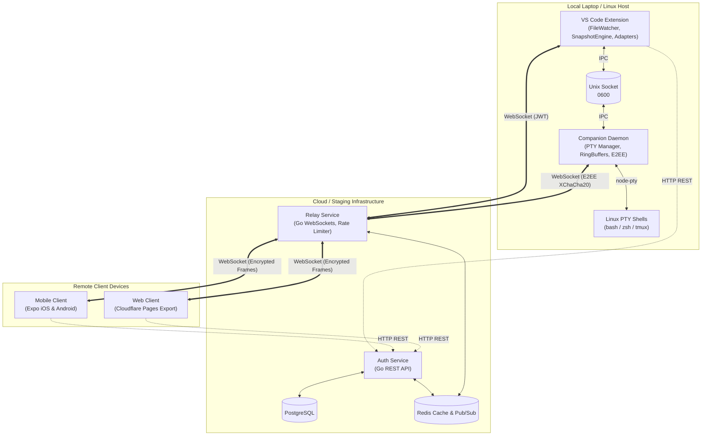
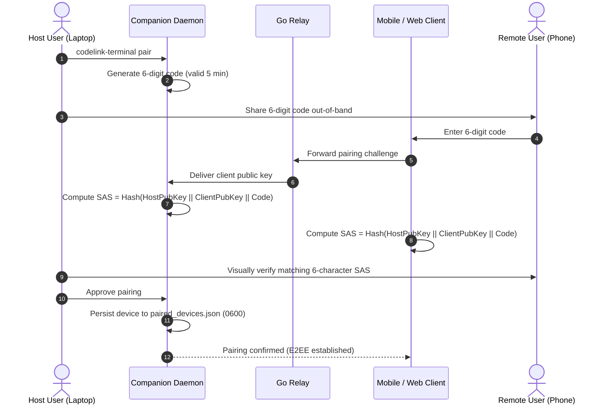
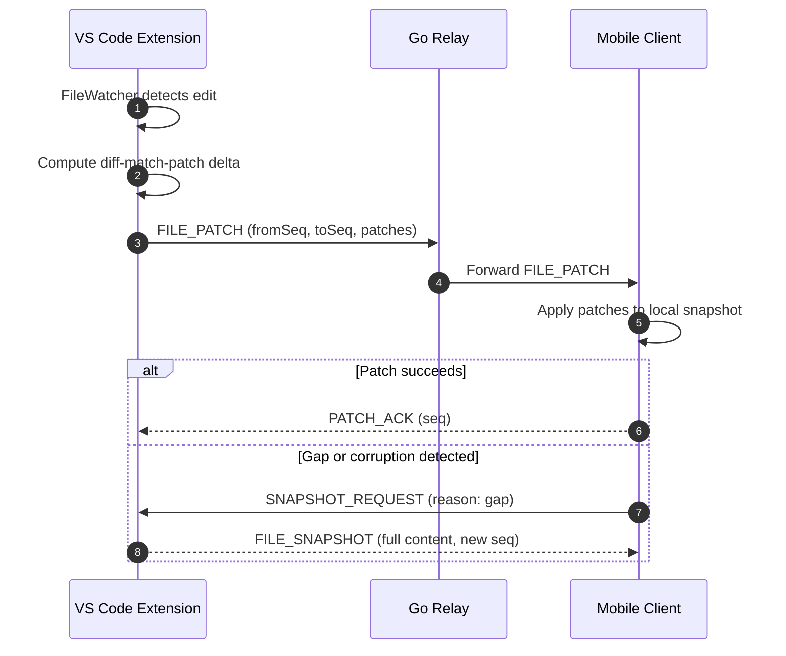
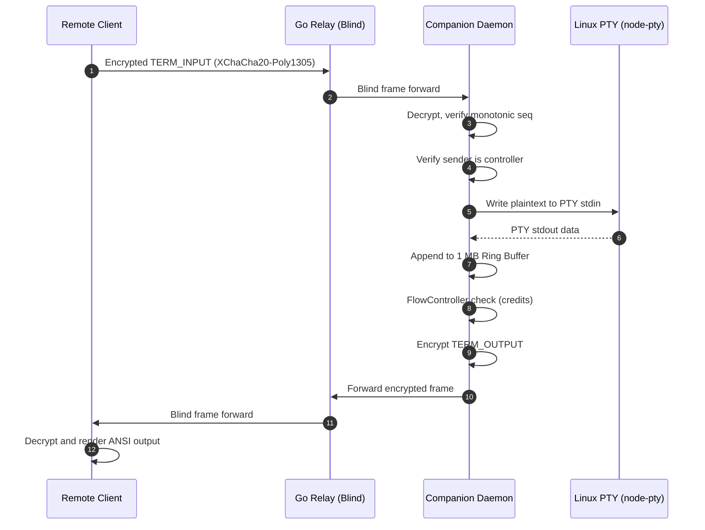

# CodeLink Architecture

This document describes the architectural design, component relationships, data protocols, and security models of CodeLink.

---

## 1. System Overview

CodeLink is a developer tool designed to bridge local software engineering environments with remote mobile and web devices. It provides two core capabilities:

1. **AI Code Review & Targeted Prompt Injection**: Real-time git diff review, line-range selection, speech-to-text voice dictation, and secure prompt injection directly into local AI code editors (Continue, Kiro, Cursor, and Antigravity).
2. **Managed Interactive Terminal**: Full Linux pseudoterminal (PTY) shell execution running as the host user, end-to-end encrypted (payload-blind relay), independent of IDE lifecycle, with multi-tab persistence, single-controller enforcement, and host takeover controls.

---

## 2. High-Level Architecture Diagram



---

## 3. Monorepo Workspace Structure

The project is structured as a TypeScript/Go monorepo:

```
codelink/
├── packages/
│   ├── protocol/            # Shared types, binary schemas, envelopes & validation
│   ├── vscode-extension/    # Local VS Code extension, editor adapters & IPC client
│   ├── companion/           # Standalone Linux PTY companion daemon & CLI
│   └── mobile/              # React Native Expo app & React Native Web export
├── services/
│   ├── auth/                # Go REST service (JWT, session storage, device keys)
│   └── relay/               # Go WebSocket service (blind router, rate limiter)
├── docs/                    # Staging rules, deployment guidelines & guides
└── scripts/                 # Maintenance, build, and deployment automation
```

### Component Roles

#### `@codelink/protocol` (`packages/protocol`)

- Shared TypeScript definitions, schemas, and runtime type guards for both editor and terminal message protocols.
- Frame sizing caps (32 KB max frame size) and envelope builders (`buildEnvelope`, `buildTerminalEnvelope`).
- Protocol versioning (`v2.0` editor sync, `v1.0` managed terminal).

#### `@codelink/companion` (`packages/companion`)

- Autonomous Linux daemon (`codelink-terminal`) running independently of VS Code.
- **PtyManager**: Native POSIX pseudo-terminal lifecycle using `node-pty`. Manages child process groups and guarantees recursive child termination (`pgrep -P` and `process.kill(-pid, 'SIGKILL')`).
- **RingBuffer**: Fixed 1 MB circular buffers per session with monotonic offsets and gap detection.
- **SessionTable**: Tracks up to 8 concurrent persistent shells, enforces single-controller write privileges, and manages 6-hour control idle timeouts.
- **Crypto & E2EE**: Libsodium XChaCha20-Poly1305 AEAD authenticated encryption, monotonic sequence tracking, and Short Authentication String (SAS) generation.
- **AuditLogger**: Append-only structured log at `~/.codelink/terminal-audit.log` (mode `0600`) with zero terminal payload retention.
- **SocketServer**: Local Unix domain socket listener (`0600`) at `$XDG_RUNTIME_DIR/codelink-terminal.sock` or `~/.codelink/terminal.sock`.

#### `codelink-extension` (`packages/vscode-extension`)

- **FileWatcher**: Debounced workspace file-system observer that detects dirty states and diffs against Git `HEAD`.
- **SnapshotEngine & PatchEncoder**: Computes differential patch deltas via `diff-match-patch`.
- **EditorRegistry**: Pluggable adapters dispatching injected prompts to Continue, Kiro, Cursor, and Antigravity editors.
- **Security Boundary**: Enforces workspace boundary confinement (`resolveTargetFile`) to prevent directory traversal outside active project folders.
- **TerminalStatusBar & Client**: Connects to the local companion Unix socket to display active session counts, trigger host takeover, and invoke emergency kill switches.

#### `mobile` (`packages/mobile`)

- Cross-platform React Native Expo application (iOS, Android, and Cloudflare Pages Web export).
- **Interactive Diff Viewer**: Visual split/unified diffs with multi-range line selection.
- **Voice Dictation Console**: Real-time microphone audio transcription and prompt composition.
- **Terminal UI**: Multi-tab switcher, dark theme ANSI scrollback view, touch special-keys bar (`Esc`, `Tab`, sticky `Ctrl`, sticky `Alt`, arrows, `^C`, `^D`), and multiline paste confirmation modal.

#### `services/auth` (`services/auth`)

- Go REST API handling device registration, RSA public key verification, and short-lived JWT generation.
- Backed by PostgreSQL for persistent user/device records and Redis for session token caches.

#### `services/relay` (`services/relay`)

- Go WebSocket message hub routing encrypted envelopes between paired devices.
- **Strictly Payload-Blind**: The relay routes raw frames without access to cryptographic keys, plaintext, or session state.
- **DoS Protection**: Enforces 32 KB frame size caps and per-connection token bucket rate limiting (100 req/s, burst 200).

---

## 4. Protocols & Communication Flows

### A. Device Pairing & SAS Verification

Mutual authentication prevents Man-in-the-Middle (MitM) attacks:



### B. Differential File Sync Flow

Efficiently synchronizes editor modifications with minimal bandwidth:



### C. Managed Interactive Terminal PTY Flow

Stateful PTY execution with flow control and host takeover:



---

## 5. Security & Threat Mitigation

| Threat / Risk                       | Architectural Mitigation                                                                                                                                          |
| :---------------------------------- | :---------------------------------------------------------------------------------------------------------------------------------------------------------------- |
| **Relay Compromise / Snooping**     | **Payload-Blind Relay**: Terminal frames are end-to-end encrypted with XChaCha20-Poly1305 AEAD. The relay holds no keys and cannot decrypt PTY data.              |
| **Replay & Frame Reordering**       | **Monotonic Sequencing**: Every frame carries an incrementing 64-bit sequence counter. Stale or duplicate frames fail AEAD verification and are dropped.          |
| **Unauthorized Host Access**        | **Default OFF & SAS Pairing**: Terminal execution is disabled by default. Pairing requires out-of-band SAS code confirmation and explicit host approval.          |
| **Directory Traversal via Prompts** | **Path Boundary Confinement**: `resolveTargetFile` verifies that all target paths resolve strictly within active workspace folders; traversal outside is blocked. |
| **Accidental Multiline Execution**  | **Paste Confirmation Modal**: The mobile/web terminal intercepts multiline pastes, displays line counts and previews, and requires explicit user confirmation.    |
| **Buffer Exhaustion / Flooding**    | **Bounded Buffers & Rate Limiting**: 32 KB frame cap, token bucket rate limiter (100 req/s), bounded 1 MB ring buffers, and credit-based flow control.            |
| **Stale Remote Controllers**        | **6-Hour Control Idle Timeout**: 6 hours of controller inactivity automatically revokes control to Observe/detached while keeping shells alive.                   |
| **Host Precedence Loss**            | **Host Takeover**: Laptop host can reclaim control at any time via CLI or VS Code, immediately demoting remote controllers to Observe.                            |
| **Orphan Background Processes**     | **Process Group Signaling**: Companion sends `SIGKILL` to the process group (`-pid`) and recursively inspects child PIDs (`pgrep -P`) on session close.           |
| **Secrets in System Logs**          | **Zero-Payload Audit Log**: Structured audit logs record lifecycle metadata only; terminal payloads, keystrokes, and keys are strictly excluded.                  |

---

## 6. Deployment & Environment Topology

| Component             | Local Development                   | Staging Environment                           | Production                         |
| :-------------------- | :---------------------------------- | :-------------------------------------------- | :--------------------------------- |
| **Auth Service**      | Docker Compose (`:8081`)            | Railway (PostgreSQL + Redis)                  | Railway Managed Cluster            |
| **Relay Service**     | Docker Compose (`:8082`)            | Railway (Redis Pub/Sub)                       | Railway High-Availability          |
| **Companion Daemon**  | Local process (`codelink-terminal`) | Systemd user unit (`~/.config/systemd/user/`) | Systemd user unit                  |
| **VS Code Extension** | VS Code Extension Host              | VSIX local install                            | VS Code Marketplace                |
| **Mobile App**        | Expo CLI (`npx expo start`)         | EAS Build (`preview` APK)                     | EAS Build / App Store / Play Store |
| **Web Client**        | Webpack dev server (`:8083`)        | Cloudflare Pages Export                       | Cloudflare Pages Production        |
